<div align="center">

# GIS-Based Delineation of Areas Suitable for Livestock Slurry Application

### Case Study — Tudela, Navarre, Spain

[](./LICENSE)


**Author:** Naziru Halilu

A GIS multicriteria decision analysis (MCDA) suitability overlay, extended with
continuous geostatistical and deep-learning suitability surfaces, for identifying
land suitable for livestock slurry application.

</div>

---

## Table of Contents

- [Overview](#overview)
- [Methodology Pipeline](#methodology-pipeline)
- [Key Results](#key-results)
- [Figures](#figures)
- [Repository Structure](#repository-structure)
- [Reproducing the Analysis](#reproducing-the-analysis)
- [Notes on the Modelling Design](#notes-on-the-modelling-design)
- [Documents](#documents)
- [License](#license)

---

## Overview

This project identifies land suitable for livestock slurry application in the
municipality of Tudela (Navarre, Spain) through two complementary layers of analysis:

| Layer | Method | Output |
|---|---|---|
| **1. Hard-constraint screening** | Rule-based GIS-MCDA overlay (slope, soil, hydrology, land use, protected/nitrate-vulnerable zones) | Binary candidate zone |
| **2. Continuous suitability surface** | Fuzzy Suitability Index (SI), Regression Kriging, and deep-learning surrogates | Continuous 0–100 suitability surface across the candidate zone |

The continuous layer is built and validated with:
- **Regression Kriging** — linear-trend (RK-LM) and random-forest-trend (RK-RF) variants, via PyKrige
- **Deep learning surrogates** — a dense MLP and a patch-based CNN (TensorFlow/Keras)
- **Rigorous validation** — spatial block cross-validation, Moran's I of residuals, permutation feature importance, and a Taylor diagram

---

## Methodology Pipeline

```
 1. build_covariates.py     → 25 m raster covariate stack (slope, distances, soil, land use, NVZ)
 2. mcda_reference.py       → hard-constraint candidate zone + continuous fuzzy Suitability Index
 3. sample_points.py        → pseudo-observation network + spatial block train/test split
 4. regression_kriging.py   → RK-LM & RK-RF fitting, variogram modelling, full-grid prediction
 5. deep_learning.py        → DL-MLP & DL-CNN training, full-grid prediction
 6. validation_stats.py     → Moran's I, Taylor-diagram statistics, permutation importance
 7. make_figures_1–5.py     → all 12 publication-quality figures
```

---

## Key Results

Held-out spatial-block test set, *n* = 127:

| Model | RMSE ↓ | MAE ↓ | R² ↑ | Correlation ↑ | Residual Moran's I ↓ |
|:--|:--:|:--:|:--:|:--:|:--:|
| RK-LM | 11.01 | 8.44 | 0.531 | 0.82 | 0.043 |
| **RK-RF** | **7.78** | **6.53** | **0.765** | **0.89** | **0.017** |
| DL-MLP | 9.92 | 7.49 | 0.619 | 0.83 | 0.038 |
| DL-CNN | 9.90 | 7.82 | 0.620 | 0.87 | 0.061 |

**Random-forest regression kriging (RK-RF)** gave the most accurate and best spatially
behaved reconstruction of the continuous suitability surface — lowest error, highest
fit, and lowest residual spatial autocorrelation (a well-behaved model should leave
little spatial structure in its errors).

---

## Figures

<table>
<tr>
<td width="50%">

**Figure 1 — Study Area & DEM**
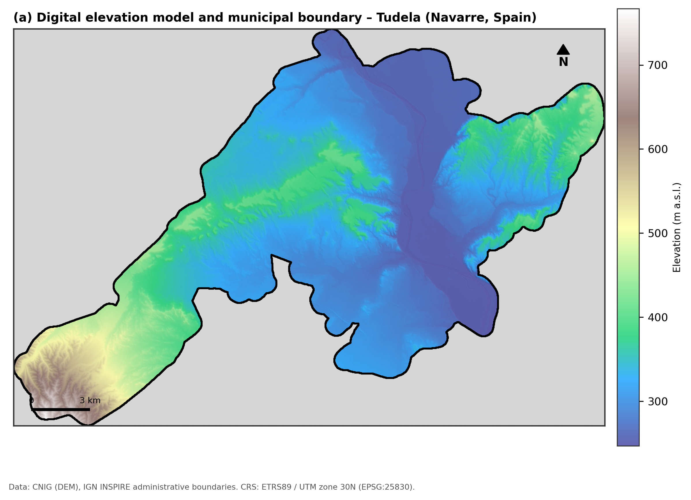

</td>
<td width="50%">

**Figure 2 — Exclusion Criteria**
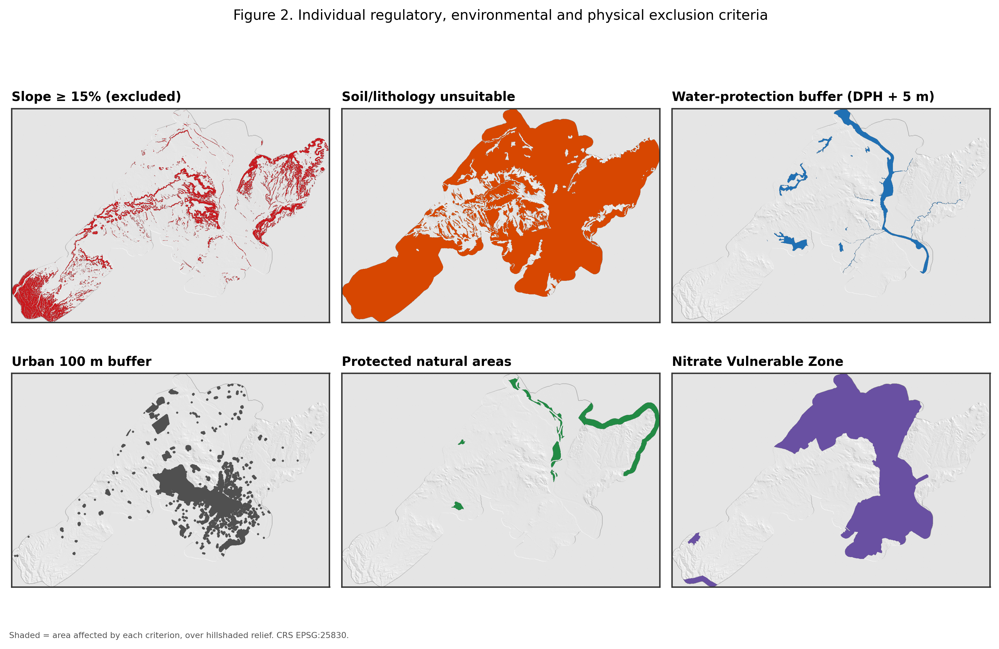

</td>
</tr>
<tr>
<td width="50%">

**Figure 3 — Candidate Zone & Sample Points**
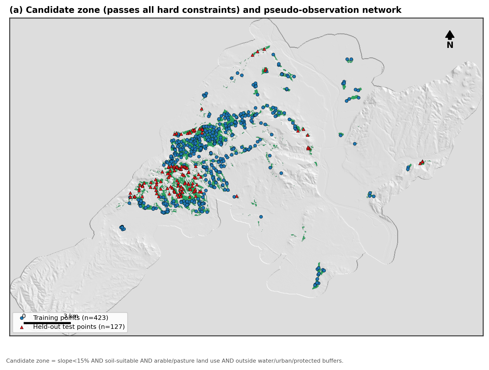

</td>
<td width="50%">

**Figure 4 — Reference Suitability Index**
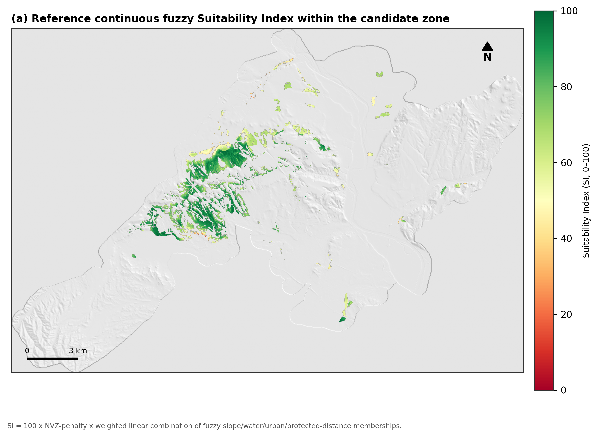

</td>
</tr>
<tr>
<td width="50%">

**Figure 5 — Variogram**
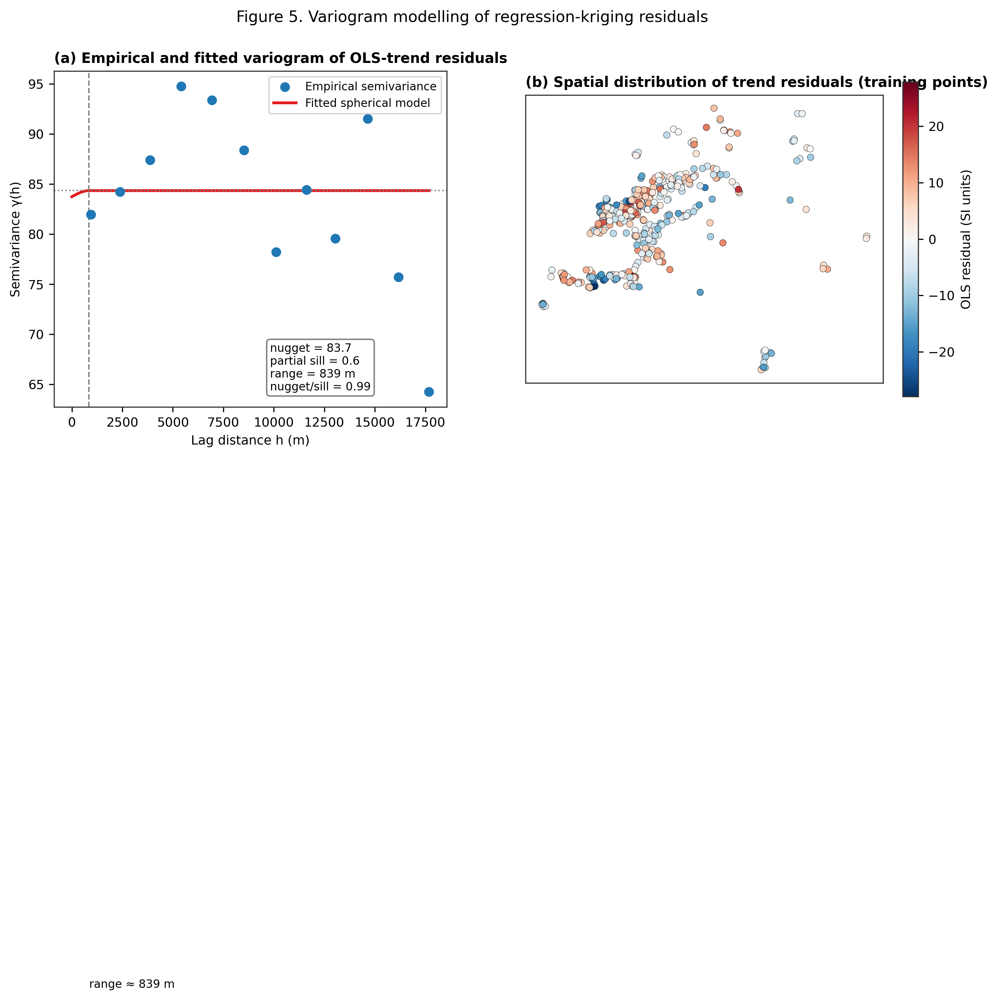

</td>
<td width="50%">

**Figure 6 — RK Prediction Variance**
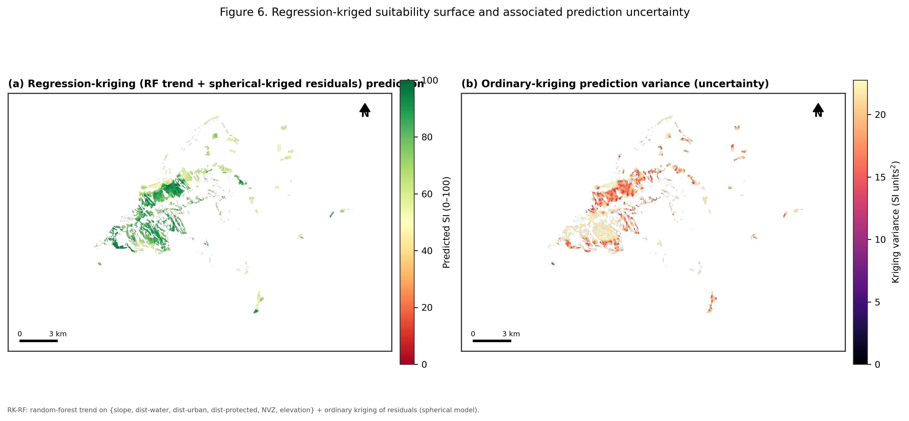

</td>
</tr>
<tr>
<td width="50%">

**Figure 7 — Deep Learning Architectures & Training**
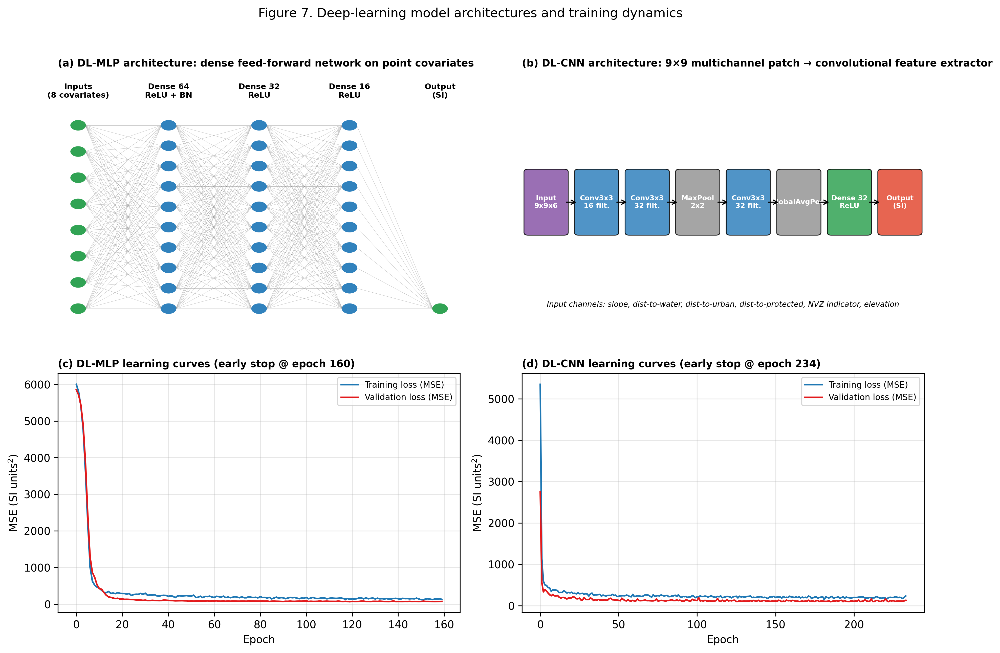

</td>
<td width="50%">

**Figure 8 — Observed vs. Predicted**
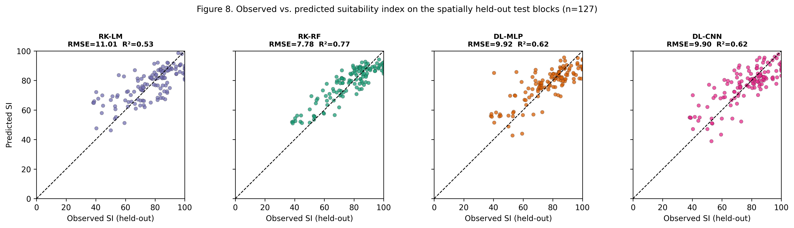

</td>
</tr>
<tr>
<td width="50%">

**Figure 9 — Taylor Diagram**
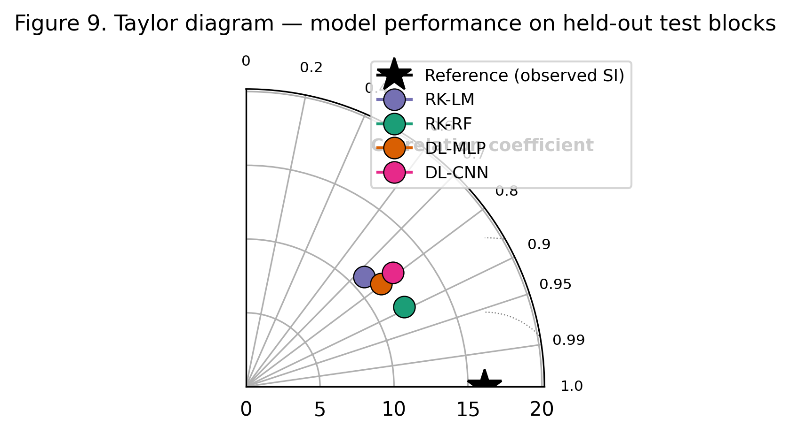

</td>
<td width="50%">

**Figure 10 — Model Comparison Maps**
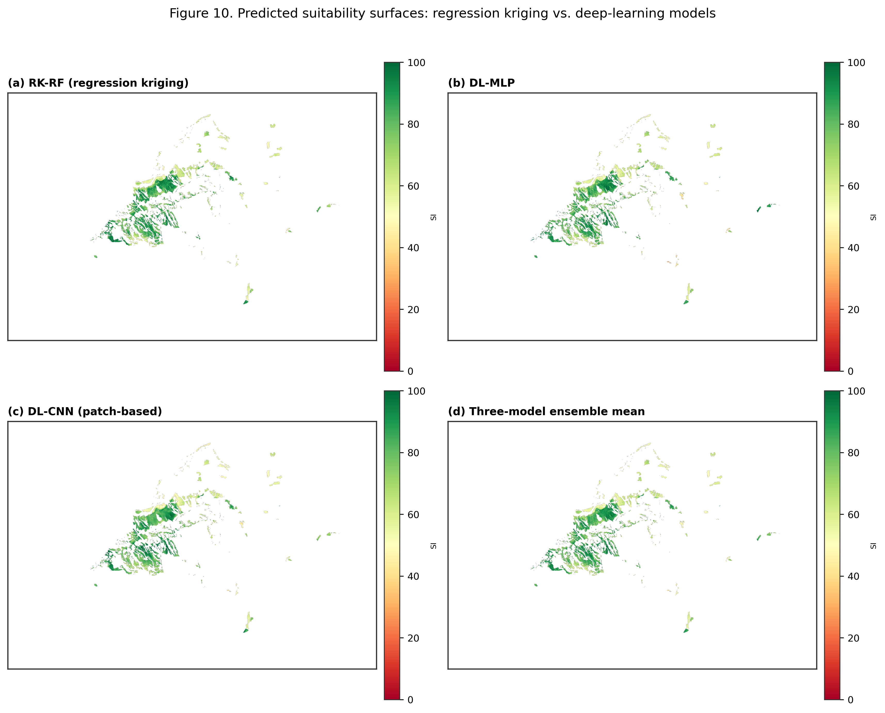

</td>
</tr>
<tr>
<td width="50%">

**Figure 11 — Ensemble Uncertainty**
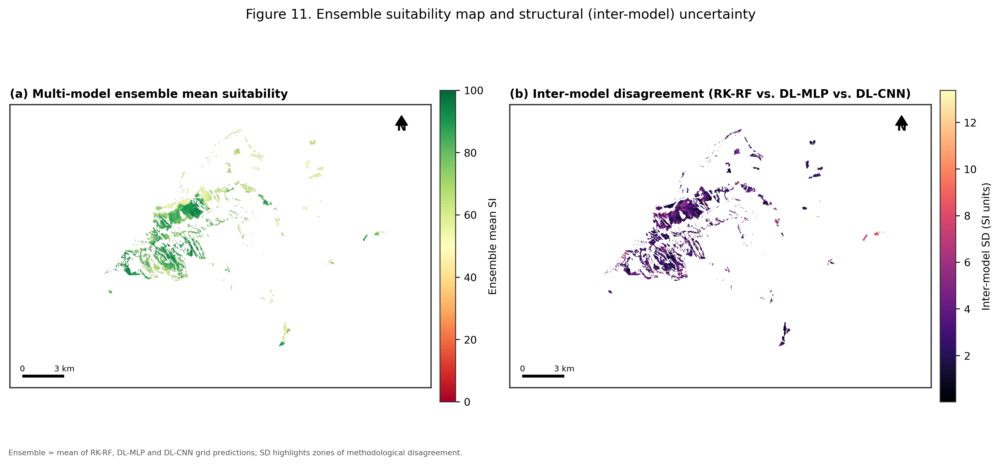

</td>
<td width="50%">

**Figure 12 — Feature Importance**
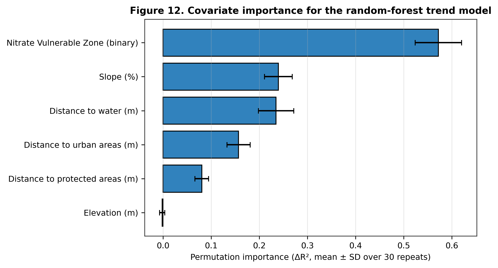

</td>
</tr>
</table>

---

## Repository Structure

```
.
├── README.md
├── LICENSE
├── Tudela_Slurry_Suitability_Merged_Report.docx      # Combined report: MCDA + RK/DL methodology and results
├── manuscript/
│   └── Slurry_Suitability_RegressionKriging_DeepLearning_Manuscript.docx
│                                                       # Q1-journal-style manuscript — 15 pages, 12 figures,
│                                                       # 2 tables, 14 references, clickable internal citations
├── code/                                              # Full reproducible Python pipeline
│   ├── build_covariates.py
│   ├── mcda_reference.py
│   ├── sample_points.py
│   ├── regression_kriging.py
│   ├── deep_learning.py
│   ├── validation_stats.py
│   ├── make_figures_1.py … make_figures_5.py
│   └── cartohelpers.py                                # shared cartographic helpers (scale bar, north arrow, styling)
├── figures/                                           # All 12 publication-quality figures (300 dpi PNG)
└── outputs_data/                                      # Numeric results (JSON) and pseudo-observation points (CSV)
```

---

## Reproducing the Analysis

**Requirements:** `geopandas`, `rasterio`, `shapely`, `pyproj`, `fiona`, `pykrige`,
`scikit-learn`, `tensorflow`, `matplotlib`, `pandas`, `numpy`, `scipy`

Run in order from a directory containing the original 9 unzipped source layers
(`AOI/`, `Digital_elevation_model/` → merged into `AOI/AOI/DEM_AOI.tif`, etc.), adjusting
the `DATA` / `OUT` path constants at the top of each script as needed:

```bash
python code/build_covariates.py      # → covariates.npz, grid_meta.json
python code/mcda_reference.py        # → mcda_reference.npz, mcda_stats.json
python code/sample_points.py         # → sample_points.csv
python code/regression_kriging.py    # → RK_grid_prediction.npz, variogram_residuals.npz, rk_results.json
python code/deep_learning.py         # → DL_grid_predictions.npz, dl_training_history.npz, dl_results.json
python code/validation_stats.py      # → validation_extra.json, feature_importance.json
python code/make_figures_1.py        # ┐
python code/make_figures_2.py        # │
python code/make_figures_3.py        # ├─ figures/*.png
python code/make_figures_4.py        # │
python code/make_figures_5.py        # ┘
```


---

## License

Released under the [MIT License](./LICENSE).
